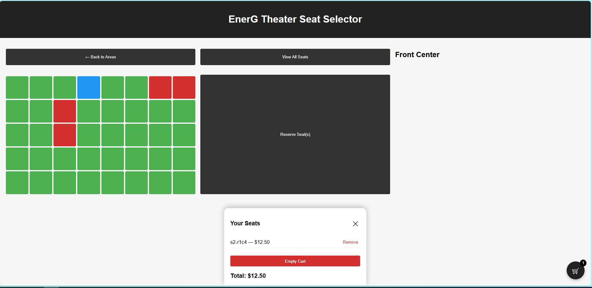

# 🎬 EnerG Theater Seat Selector — Version 1.0

A modern, responsive, and interactive cinema seat selection interface built with **HTML, CSS, and JavaScript**.  
Designed with a clean, minimalist aesthetic and a mobile‑native UX inspired by real ticketing platforms.

This project demonstrates dynamic rendering, state management, responsive layouts, and polished UI interactions — making it an excellent portfolio piece for front‑end engineering.

---

## 🚀 Live Demo
(GitHub Pages link)

---

## 📸 Screenshots

### Desktop Layout

### Section Detail View

### Cart Panel

Review the Assets folder for screenshots
---

# ✨ Features (Version 1.0)

### 🎯 Core Functionality
- Dynamic seat map generation  
- Multi‑seat selection  
- Real‑time pricing and running total  
- Reservation confirmation with seat summary  
- Section detail view with “Back” and “View All Seats” options  

### 🛒 Modern Cart System
- Floating cart button with minimalist dark badge  
- Slide‑up bottom‑sheet cart panel (optimized width)  
- Remove individual seats  
- Empty cart button  
- Automatic total calculation  

### 📱 Responsive Layouts
- Desktop: 3‑column seat cluster grid  
- Mobile: Section dropdown + detail view  
- Floating cart button adapts to all screen sizes  

### 🎨 UI & UX Polish
- Section titles displayed above each seat cluster  
- Optimized cart panel width for better viewing  
- Clean, minimalist styling  
- Hybrid comments throughout the codebase  
- Smooth layout transitions  

---
### Future Enhancements
- VIP/Standard seat pricing
- Animations
- Checkout Modal
- LocalStorage persistence
- Admin Mode

---

# 🧩 Tech Stack

- **HTML5** — semantic structure  
- **CSS3** — responsive layout, modern UI styling  
- **JavaScript (ES6+)** — dynamic rendering, state management, interactions  

No frameworks. No libraries.  

---

# 🗂 Project Structure

